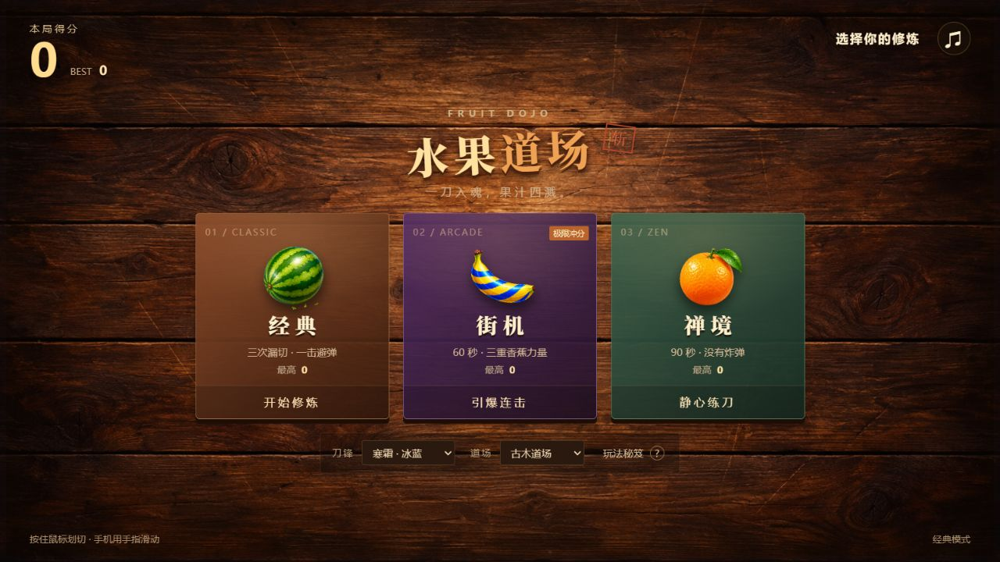
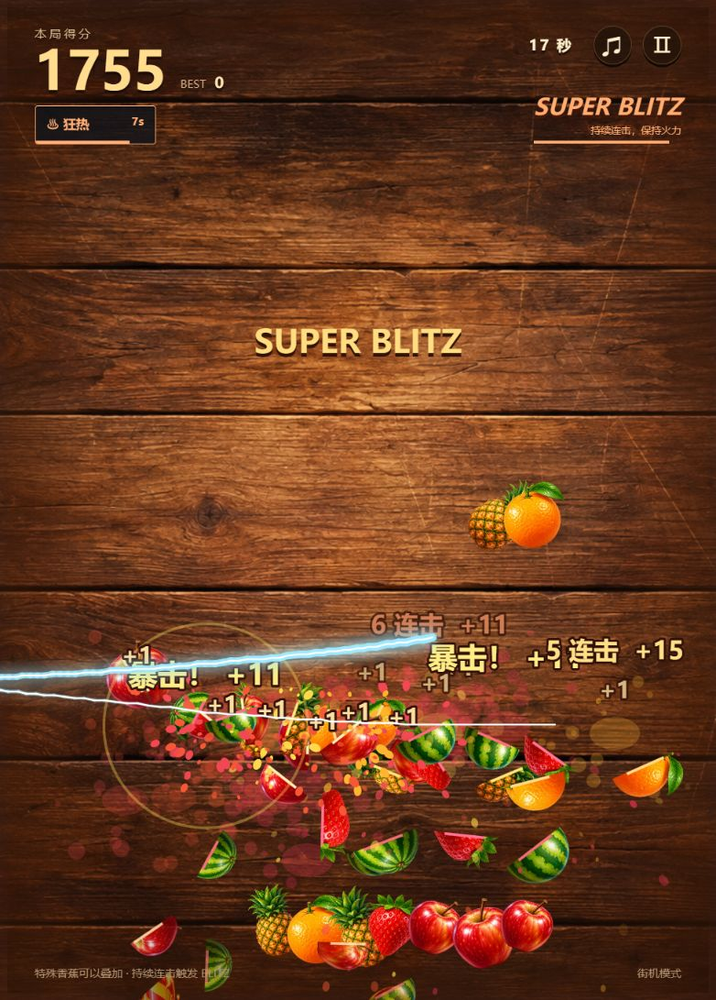

<div align="center">

# 水果道场 · Fruit Dojo

**一刀入魂，果汁四溅。**

经典生存 / 街机冲分 / 禅境练刀

[](https://tanzhilangnw.github.io/fruit-ninja/)


一个以《水果忍者》经典玩法为灵感的浏览器游戏。原创水果贴图、木质道场、刀光与果汁粒子，结合三种模式和可叠加的街机增益。桌面与触屏使用同一套输入逻辑，无需安装。

[立即游玩](https://tanzhilangnw.github.io/fruit-ninja/) · [玩法说明](#玩法与计分) · [本地开发](#本地开发) · [架构](#项目结构)



</div>

---

## 三种修炼

| 模式 | 目标 | 时间与失败条件 | 特色 |
| :--- | :--- | :--- | :--- |
| **Classic · 经典** | 在生存压力下争取最高分 | 无时间限制；漏切 3 个水果或切中炸弹后结束 | 精准划切、随机暴击 |
| **Arcade · 街机** | 叠加增益，打出连续爆发 | 基础计时 60 秒；炸弹扣 10 分并清除增益 | 特殊香蕉、Blitz、石榴连斩、结算奖励 |
| **Zen · 禅境** | 练习划切节奏和大连击 | 90 秒；不惩罚漏切 | 无炸弹、无随机暴击，专注连击 |

经典、街机和禅境对应原作的核心单人模式。当前实现并非逐版本逐参数移植：香蕉持续时间、Blitz 等级和结算奖励采用本项目的规则；未实现联机、付费道具或原作的活动系统。

## 玩法与计分

**操作**：鼠标按住左键划切；触屏用手指滑动。`Space` / `Esc` 暂停与恢复，也可使用右上角暂停按钮。切到其他标签页会自动暂停。声音、刀光、道场和个人最高分保存在当前浏览器中。

- **普通水果**：每个 +1 分。一刀划过至少 3 个水果，额外获得与水果数相同的连击分。
- **暴击**：经典与街机有 8% 概率额外 +10 分。禅境不启用随机暴击。
- **双倍香蕉**：8 秒内水果、暴击和连击奖励 ×2。
- **冰冻香蕉**：8 秒内水果运动及倒计时速度降至 43%，为精准连击留出时间。
- **狂热香蕉**：8 秒密集水果雨；清除场上的炸弹，期间不生成新炸弹。
- **力量叠加**：三个增益可同时存在，再切到同类香蕉会刷新该效果时间。
- **Blitz**：街机连续完成 2 / 4 / 6 次连击，触发 Blitz / Super Blitz / Mega Blitz；每次连击追加 5 / 10 / 15 分，受双倍影响。6 秒没有新连击则重置。
- **石榴连斩**：街机倒计时进入最后 3 秒时，开启 4.5 秒终局。快速反复划切石榴，每次有效划切得分，结束额外获得每斩 +2 的奖励。
- **结算奖励**：街机依据最高连击、避弹表现和切果数量追加三项奖励，单项规则见 `engine.js`。

> 普通划切以相邻输入采样点构成的线段检测碰撞，连击窗口为 240 ms。石榴命中有 75 ms 冷却，避免同一组高频事件重复计分。

## 画面与体验

原创手绘水果图集与透明特殊水果图集；Canvas 负责切半动画、果汁粒子、渐隐刀光和冲击波。界面提供寒霜、赤焰、紫电三套刀光，以及古木、月夜两种道场。浏览器开启“减少动态效果”时，关闭震屏和界面动画并减少粒子。

音效由 Web Audio 实时合成，第一次点击游戏后启动。素材完成加载前，开始按钮保持禁用；加载失败会提示刷新，避免进入看不见水果的局面。

<details>
<summary>查看街机实机画面</summary>



</details>

## 本地开发

仅需要静态 HTTP 服务。**运行游戏没有 npm 依赖，也不需要构建步骤。**

```bash
git clone https://github.com/tanzhilangnw/fruit-ninja.git
cd fruit-ninja
python -m http.server 8765
```

打开 [http://localhost:8765](http://localhost:8765)。修改文件后刷新页面即可。现代 Chrome、Edge、Firefox、Safari 支持所需的 Canvas、Pointer Events 和 Web Audio API；低版本浏览器未单独验证。

### 规则测试

Node.js 18+，使用内置测试运行器：

```bash
node --test tests/engine.test.cjs
```

测试覆盖模式计时、划切碰撞、连击与暴击计分、香蕉叠加和过期、冰冻、狂热避弹、Blitz 重置、暂停、失败条件以及终局奖励。规则引擎支持注入随机数，测试不依赖 DOM 或实际帧率。

## 项目结构

```text
fruit-ninja/
├── index.html              # 模式选择、HUD、暂停、结算与玩法说明
├── style.css               # 道场主题、增益反馈、响应式与减少动态效果
├── engine.js               # 模式规则、实体物理、碰撞、计分和事件
├── game.js                 # 渲染、音效、输入、界面、资源加载及本地存储
├── fruits.png              # 普通水果与炸弹图集
├── specials.png            # 三种香蕉与石榴透明图集
├── wood.png                # 木质道场背景
├── tests/engine.test.cjs    # 可重复执行的规则回归测试
└── .nojekyll               # 禁用 GitHub Pages 的 Jekyll 处理
```

`FruitEngine` 只负责规则与状态，使用 `update(dt)` 推进时间，`swipe(a, b)` 检测划切，再通过事件队列向展示层传递 `slice`、`combo`、`power`、`blitz`、`over` 等事件。展示层使用 `requestAnimationFrame`，限制单帧最大步长，避免后台恢复时产生大幅物理跳跃。

Canvas 的像素倍率上限为 2；粒子、果汁残留和刀光采样均设有数量上限。已启用浏览器 WebMCP 时，页面还会注册状态读取、开始游戏和暂停工具，复用可见按钮的同一套动作。

## 发布与同步

GitHub Pages 从 **`main` → `/ (root)`** 发布。提交并推送后自动更新网站，不使用额外部署服务。

```bash
git pull --ff-only
# 修改并运行测试
git add .
git commit -m "Describe the gameplay change"
git push origin main
```

两台电脑共享仓库代码；个人最高分与外观设置保存在各自浏览器，**不进行云同步**。浏览器缓存旧版本时，强制刷新再检查。

## 设计参考与素材

玩法参考 Halfbrick 的[原作入门指南](https://www.halfbrick.com/blog/the-ultimate-beginners-guide-to-fruit-ninja)和[街机模式介绍](https://www.halfbrick.com/blog/fruit-ninja-arcade-mode-announced)。图片为本项目生成的原创素材；未使用官方美术、商标图形或音频。中文衬线字体由 Google Fonts 提供，无法访问时回退到系统字体。本项目与 Halfbrick 无关联。
